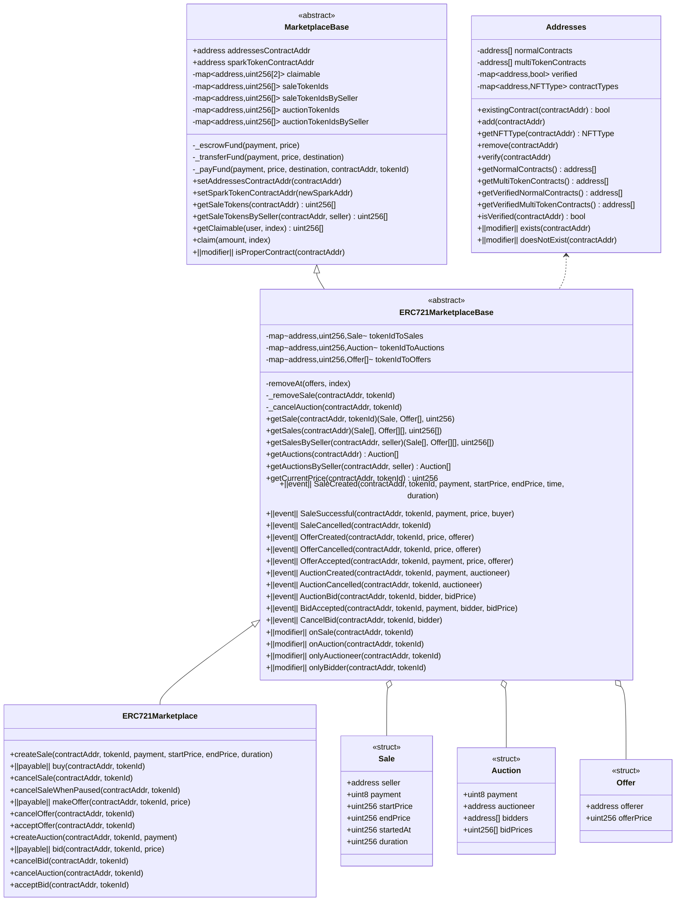
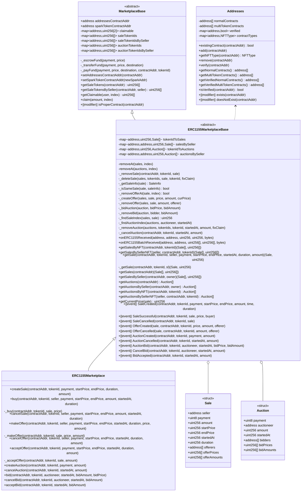
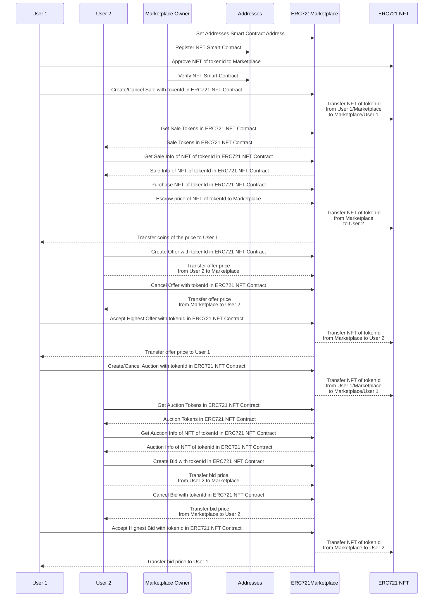
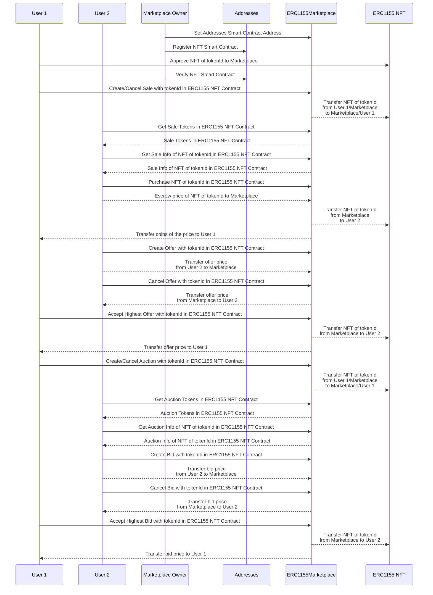

# NFT Marketplace Flow









# Smart Contract Project Setup and Test

This project is the NFT Marketplace Smart Contract integrating tools for unit test using Hardhat.

# Smart Contract Project Setup

Please install dependency modules
```shell
yarn
```

Please compile Smart Contracts
```shell
yarn compile
```

# Project Test

You can test Smart Contracts using
```shell
yarn test
```

# Deploy Smart Contracts

You can deploy Smart Contracts on the hardhat by
```shell
npx hardhat run scripts/deploy.js
```

First, you should change the .env.example file name as .env
Before deploying Smart contracts in the real networks like Ethereum or Rinkeby, you should add the chain info in the hardhat.config.js file

```javascript
{
  ...
  ropsten: {
    url: `https://ropsten.infura.io/v3/${process.env.INFURA_ID}`,
    tags: ["nft", "marketplace", "test"],
    chainId: 3,
    accounts: real_accounts,
    gas: 2100000,
    gasPrice: 8000000000
  },
  ...
}
```

You should add your wallet private key to .env file to make deploy transaction with your wallet

```javascript
...
PRIVATE_KEY=123123123123123
...
```

After that, you can deploy the Smart Contracts on the chain by

```shell
npx hardhat run scripts/deploy.js --network ropsten
```